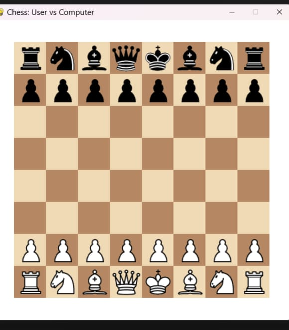
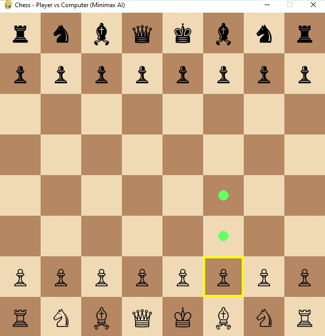
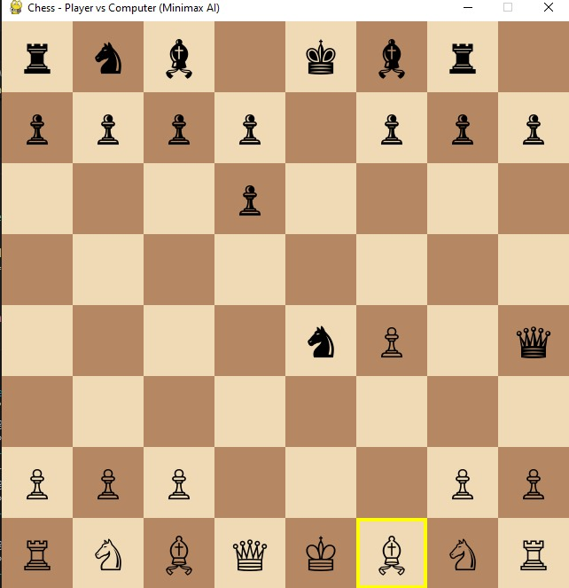

---

````markdown
# ♟️ Simple Chess in Python (Pygame + python-chess)

A lightweight, beginner-friendly chess game where **you play as White** against a basic **AI-controlled Black**. This project combines **Pygame** for GUI rendering and **python-chess** for rule enforcement, legality checking, and move generation.

---

## 📸 Screenshots

| Opening Position | In Play | Checkmate |
|------------------|---------|------------|
|  |  |  |

---

## ▶️ How to Run

### 🛠️ Step-by-Step Instructions

1. **Clone or Download** this repository:

```bash
git clone https://github.com/yourusername/simple_chess.git
cd simple_chess
````

2. **Install Required Packages**:

```bash
pip install pygame python-chess
```

3. **Ensure Directory Layout**:

```
simple_chess/
├── chess_game.py
├── assets/
│   ├── wp.png  …  bk.png
│   └── board_background.png
├── screenshots/
│   ├── opening_screen.png
│   ├── in_play.png
│   └── checkmate_white.png
└── README.md
```

4. **Run the Game**:

```bash
python chess_game.py
```

---

## 💻 Requirements

* Python 3.7 or higher
* [pygame](https://www.pygame.org/docs/) – for graphics, window, and input
* [python-chess](https://python-chess.readthedocs.io/) – for move validation, game rules, and chess logic

Install via:

```bash
pip install pygame python-chess
```

---

## 🎮 How to Play

* Click a **White** piece to select it.
* Legal moves will be **highlighted in green**, and the selected piece will be **highlighted in yellow**.
* Click a green square to **move**.
* The **AI (Black)** will automatically reply after your move.
* **Press `R`** at any point to restart the game.
* The game ends on **checkmate**, **stalemate**, or draw (via 75-move rule, repetition, or insufficient material).

---

## 🧠 AI Algorithm

The AI uses the **Minimax algorithm with Alpha-Beta Pruning** for decision-making:

* **Depth**: 2-ply search (1 move each for Black and White)
* **Evaluation**: Material count + terminal state check
* **Optimization**: Alpha-Beta pruning reduces unnecessary branches

This makes the AI "just good enough" for practice—fast and understandable, ideal for beginners.

---

## 🚀 Features

* Fully playable **8×8 Pygame-rendered board**
* **Click-based interface** with valid move highlighting
* **Auto pawn promotion** to Queen
* Basic **Minimax AI** with material evaluation
* End-game detection: Checkmate, Stalemate, Draws
* **Simple GUI** using Unicode chess symbols

---

## 🔮 Future Improvements (Ideas)

* [ ] Option to play as Black
* [ ] Move history with PGN export
* [ ] Sound effects for moves/captures
* [ ] Undo / Redo functionality
* [ ] Stronger AI (deeper Minimax or Stockfish via UCI)
* [ ] Custom pawn promotion choice

---

## 📜 License

This project is licensed under the **MIT License**. Feel free to modify, use, or distribute it.

---

## 🙌 Credits

* Fonts and symbols: Unicode Chess Symbols
* Libraries: `pygame`, `python-chess`

```

---