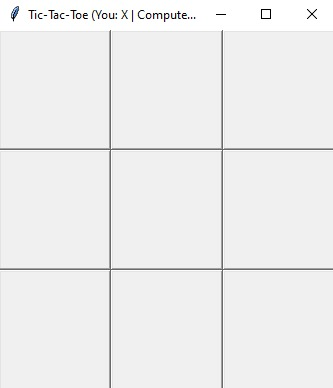

# Tic-Tac-Toe Game (Human vs Computer)

This is a classic Tic-Tac-Toe game implemented in Python using the `tkinter` GUI framework. You play as **X**, and the computer plays as **O**, powered by the **Minimax algorithm** for an unbeatable AI experience.

---

## 📦 Requirements

Before running the game, make sure you have Python installed on your system.

### ✅ Pre-installed Libraries:

* `tkinter` (comes bundled with standard Python installations)
* `math` (standard Python module)

No external packages are required.

---

## ▶️ How to Run the Game

1. Save the code into a Python file, e.g., `tic_tac_toe.py`
2. Open your terminal or command prompt.
3. Navigate to the folder containing the file.
4. Run the following command:

```bash
python tic_tac_toe.py
```

A GUI window will open for the game.

---

## 🎮 How to Play

* The player is **X** and always plays first.
* Click any square in the 3x3 grid to make your move.
* The computer will respond immediately using the Minimax strategy.
* The game announces the result via a popup message:

  * You win!
  * Computer wins!
  * It's a draw!
* The board automatically resets for a new game after each round.

---

## 🧠 AI Algorithm Used

### Minimax Algorithm

The computer's decisions are powered by the **Minimax algorithm**, a recursive strategy used in decision-making and game theory. It assumes that your opponent (the human) will always play optimally and tries to minimize the possible loss.

Key properties:

* Optimal play (unbeatable AI)
* Depth-based scoring system:

  * +1 if AI wins
  * -1 if player wins
  * 0 for a draw

---

## 🖼️ Screenshots

> 🧩 Here are some visuals of the game:

### **Game Board**


### **Player's Turn**

### **Computer's Turn**

### **after compelete game with multiple moves**

### **Draw Screen**

### **New game with multiple moves**

### **Winning Screen (Computer Wins)**
.jpg)

---

**Suggested file structure:**

```
/your-project-folder
|-- tic_tac_toe.py
|-- README.md
|-- screenshots/
    |-- Game Board.jpg
    |-- Player's Turn.jpg
    |-- Computer's Turn.jpg
    |-- after compelete game with multiple moves.jpg
    |-- Draw Screen.jpg
    |-- New game with multiple moves.jpg
    |-- Winning Screen (Computer Wins).jpg
```

To add screenshots in your `README.md`:

```markdown


```

---

## 💡 Tips

* You cannot beat the AI if it plays first or second correctly.
* Try to create forks and block opponent's forks to play smart.

---

## 📜 License

This project is open-source and free to use for learning or modification purposes.
